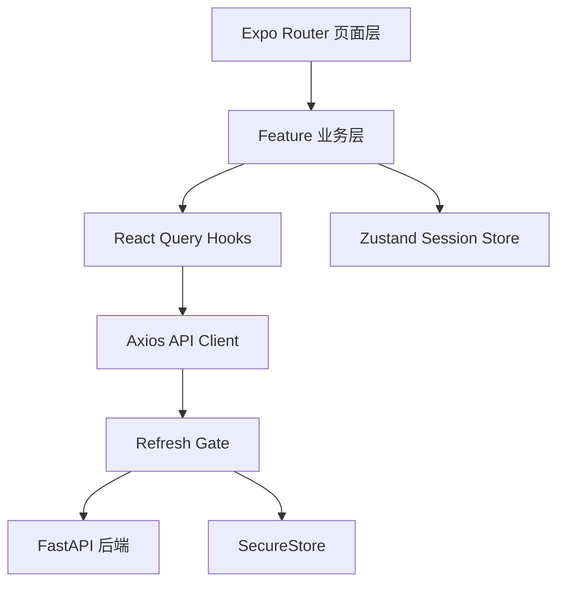
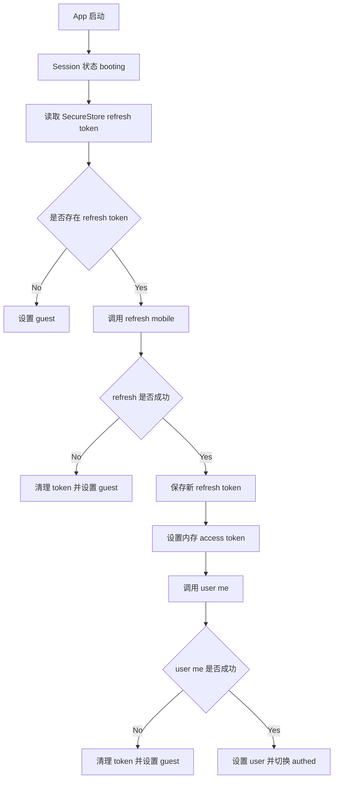
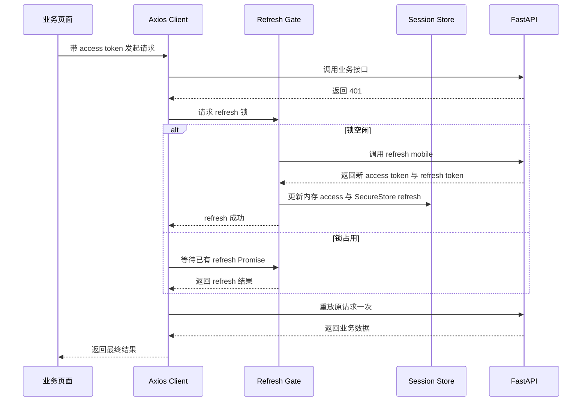

# Expo 移动端鉴权与功能扩展架构方案

## 1. 背景与目标

本方案仅面向移动端，运行环境为 Expo Go。
手机与后端在同一局域网。
鉴权采用移动端非 Cookie 模式，并启用 refresh token rotation。

核心目标：

1. 在当前简单实现基础上，建立稳定鉴权底座。
2. 为后续日记等业务提供可扩展架构。
3. 保持移动端安全边界清晰，降低后续维护成本。

## 2. 后端契约确认

API 前缀：`/api/v1`

- `POST /login/mobile`
  - Content Type: `application/x-www-form-urlencoded`
  - 参数：`username`、`password`
  - 返回：`access_token`、`refresh_token`、`token_type`
- `POST /refresh/mobile`
  - Content Type: `application/json`
  - 参数：`refresh_token`
  - 返回：`access_token`、`refresh_token`、`token_type`
  - rotation：开启，旧 refresh token 会被拉黑
- `POST /logout/mobile`
  - Content Type: `application/json`
  - 参数：`refresh_token`
  - 可选 Header：`Authorization: Bearer <access_token>`
- `GET /user/me/`
  - Header：`Authorization: Bearer <access_token>`

## 3. 技术选型

### 3.1 核心库

- 路由：`expo-router`
- 网络层：`axios`
- 服务端状态：`@tanstack/react-query`
- 会话状态：`zustand`
- 安全存储：`expo-secure-store`
- 表单状态：`react-hook-form`
- 规则校验：`zod` 与 `@hookform/resolvers`

### 3.2 为什么当前选 Axios

1. 拦截器机制适合统一鉴权链路。
2. 错误对象结构统一，便于全局处理。
3. 超时和重试策略更容易标准化。
4. 后续多人协作时上手成本通常更低。

说明：Axios 不会自动解决 refresh 并发问题，仍需实现 single-flight refresh gate。

### 3.3 表单与校验规范

1. 鉴权和业务表单统一使用 `react-hook-form`。
2. 字段规则和提交前校验统一使用 `zod`。
3. 页面层只消费标准化后的错误提示。
4. schema 文件优先复用，避免页面重复写规则。

## 4. Token 与会话策略

- access token：仅内存存储
- refresh token：仅 SecureStore 持久化
- user profile：内存态，配合 React Query 缓存

会话状态机：

- `booting`
- `guest`
- `authed`

## 6. 运行时架构

### 6.1 模块关系图

### 6.2 启动鉴权流程

### 6.3 Single flight 刷新时序

## 7. API Client 约定

### 7.1 请求规则

1. 受保护接口自动注入内存 access token。
2. 收到 401 且请求未重试过时：
   - 进入 refresh gate
   - refresh 成功后重放原请求一次
3. refresh 失败时：
   - 清理本地 token
   - session 切换 guest
   - 导航到登录页

### 7.2 错误标准化

统一错误对象字段：

- `status`
- `message`
- `detail`
- `traceId` 可选

## 8. 面向日记功能的扩展策略

### 8.1 Query Key 规范

- 用户信息：`['user', 'me']`
- 日记列表：`['diary', 'list', filters]`
- 日记详情：`['diary', 'detail', diaryId]`

### 8.2 Mutation 失效策略

- 新建日记成功：失效 `['diary', 'list']`
- 更新日记成功：失效详情和列表相关 key
- 删除日记成功：失效列表并移除详情缓存

### 8.3 网络稳定性策略

- 读请求可配置有限重试
- 鉴权接口默认不自动重试
- 配置 staleTime 减少重复闪烁加载

## 9. 移动端安全要点

1. access token 不落盘。
2. refresh 成功后必须替换本地 refresh token。
3. Expo Go 真机调试用局域网 IP，不用 localhost。
4. 客户端 logout 逻辑保持幂等。
5. 明确区分 401 未认证 与 403 无权限。

## 10. 环境配置

必填环境变量：

- `EXPO_PUBLIC_API_BASE_URL=http://<LAN_IP>:8000`

示例：

- `EXPO_PUBLIC_API_BASE_URL=http://192.168.1.10:8000`

## 11. 分阶段实施

### 阶段一：鉴权底座

- 建立 Axios 实例与基础配置。
- 实现 refresh gate single-flight。
- 完成 auth API 封装。
- 建立 Zustand session store 与 bootstrap 动作。
- 完成登录与注册表单，采用 `react-hook-form` + `zod`。
- 路由守卫切换为 session status 驱动。

交付标准：

- 登录、启动恢复、自动刷新、登出全部可用。

### 阶段二：数据层标准化

- 接入 React Query Provider 与默认策略。
- 固化 feature API 模板与错误处理。
- 打通页面层到 hooks 的统一调用路径。
- 固化可复用表单字段与 schema 组织方式。

交付标准：

- 新业务模块可按模板快速接入。

### 阶段三：日记功能试点

- 完成日记列表查询。
- 完成日记创建 mutation。
- 验证缓存失效、加载态与错误态。

交付标准：

- 通过一个完整业务链路验证架构可扩展性。

## 12. 验收清单

- 启动时有有效 refresh token 可进入 authed。
- access 过期后可自动 refresh 并重放一次请求。
- 并发 401 仅触发一次 refresh 请求。
- refresh 失败会清理会话并回到登录页。
- logout 会清理本地 token 与会话态。
- diary 模块可复用同一套 API 与 Query 规范。

## 13. 执行顺序

文档确认后按以下顺序落地：

1. auth 核心模块
2. session store 与路由守卫
3. 登录页与首页联通
4. React Query Provider 接入
5. diary 试点骨架
